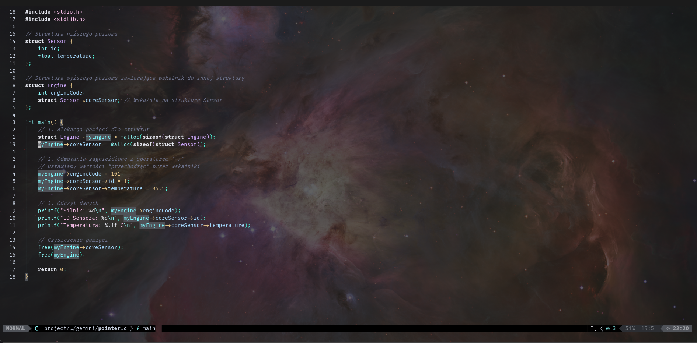

# 🌌 cosmic-galaxy.nvim  
**A premium, neon‑gradient Neovim colors & brackets engine.**  
Designed for deep focus, instant visual parsing, and cosmic aesthetics.

Cosmic Galaxy is a custom highlight engine built on top of your existing colorscheme.  
It enhances Neovim with:

- 🌈 **Galaxy Brackets** — neon gradient for nested `{}`  
- ✨ **ULTRA+ mode** — pointer‑flow, operator glow, dynamic punctuation  
- 🔭 **Cosmic clarity** — stable, readable, premium UI  
- 🪐 **Zero matchadd** — no Lua errors, no broken regex, no line wrapping  
- ⚡ **100% Treesitter + RainbowDelimiters compatible**

This is not a theme.  
This is a **cosmic augmentation layer** for your theme.

---

## 🚀 Features

### 🌈 Galaxy Brackets (ULTRA+)
- 7‑level neon gradient for `{}`  
- Each depth has its own cosmic color  
- Works with any Treesitter language  
- Zero performance overhead  

### ✨ Pointer‑Flow Highlighting
Highlights logical flow operators:

- `->`
- `=>`
- `::`
- `.`
- `:`  
- and more…

Each operator gets a neon accent for instant readability.

### 🔥 Operator Glow
Subtle glow effect on operators to improve scanning speed.

### 🪐 Stable, Zero‑Error Design
- No `matchadd`  
- No regex hacks  
- No line wrapping issues  
- Fully Lua‑native  

### 🎨 Works With Any Colorscheme
Cosmic Galaxy uses your theme’s palette (`C.*`) and enhances it.

---

## 📦 Installation

### Lazy.nvim

```lua
{
  "arkdau/cosmic-galaxy.nvim",
  config = function()
    require("cosmic-galaxy").setup()
  end,
}

## 🖼 Screenshots

### Galaxy Brackets ULTRA+


### Pointer Flow


